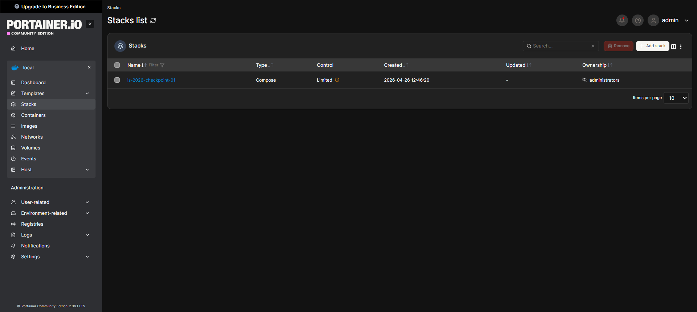
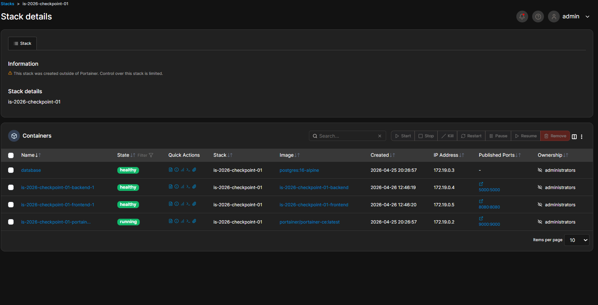

# Portainer

Portainer es la interfaz web usada para administrar y monitorear los contenedores Docker del proyecto desde el navegador.

## Configuracion

El servicio ya queda definido en `docker-compose.yml` con:

- La imagen `portainer/portain er-ce:latest`
- El socket de Docker montado en `/var/run/docker.sock`
- Un volumen nombrado `portainer_data` para persistir la configuración
- Exposición del panel en el puerto `9000`

## Acceso al panel

1. Levantar Docker Compose.
2. Abrir `http://localhost:9000` en el navegador.
3. La primera vez que se accede, crear el usuario administrador para poder ingresar.
4. Si aparece el asistente de inicio, selecciona el entorno local de Docker para ver los contenedores del proyecto.

### Capturas de Portainer en funcionamiento

